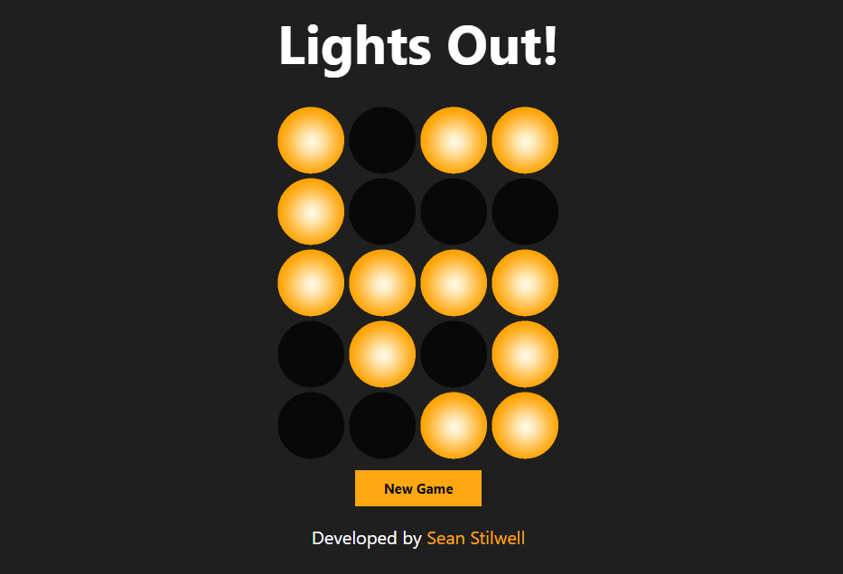

## Intro

This is a React Native game based on the [classic puzzle](https://en.wikipedia.org/wiki/Lights_Out_(game)). As a React Native app, this can be deployed as an Android or iOS app on Google Play or the App Store, but currently it's only available [on my website](http://seanstilwell.ca/Lights_Out/).

The goal of the game is deceptively simple: Turn off all the lights on the board. The challenging twist is that clicking one light will toggle the others, leaving you with a mess of lights. Sometimes there is only one possible solution (there is always at least one!).

I originally worked with this game in 2020 as a personal project during the pandemic. I decided to replace it as I've learned a lot about development and UI design since then. The original game is still [on GitHub](https://github.com/Sean-Stilwell/LightsOut).

## Installation

### Prerequisites

If desired, you'll need an Android and/or iOS emulator to use the app.

You'll need to install the Expo CLI. Documentation is [available here](https://docs.expo.dev/get-started/installation/).

### Getting Started

Clone the repo locally

```
git clone https://github.com/Sean-Stilwell/Lights_Out.git
cd Lights_Out
```

Run `npm install` in the repository, if needed.

To run the app, run one of the following commands. Note that you require an emulator to run it on either iOS or Android.

```
npm run web
npm run ios
npm run android
```

The app will then open on your chosen device, it should load similarly to the following:

